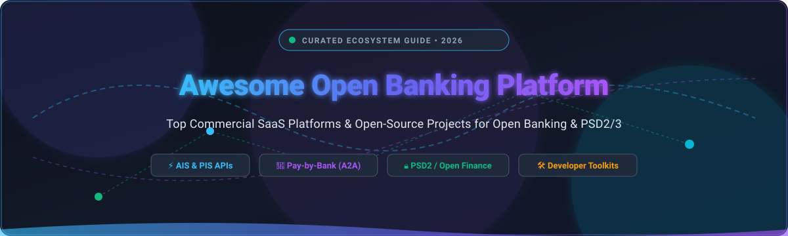

  

  
  
  
  
  
  
  

---

# 🌐 Awesome Open Banking Platform

> 🚀 **The definitive curated directory of SaaS platforms, developer APIs, and open-source software for Open Banking, PSD2/PSD3, Account Information Services (AIS), Payment Initiation Services (PIS), and Account-to-Account (A2A) Pay-by-Bank systems.**

---

## 📑 Table of Contents
- [🔍 Overview & Architecture](#-overview--architecture)
- [🏢 SaaS & Hosted Platforms](#-saashosted-platforms)
- [💻 Open-Source GitHub Projects](#-open-source-github-projects)
- [🏗️ Architectural Building Blocks](#️-architectural-building-blocks)
- [🤝 How to Contribute](#-how-to-contribute)
- [📈 Star History](#-star-history)
- [⚖️ Disclaimer & Compliance](#️-disclaimer--compliance)

---

## 🔍 Overview & Architecture

**Open Banking** empowers financial technology (Fintech) applications, modern banks, lenders, and merchants to securely access consumer and business banking data via standardized APIs with explicit user consent.

### 🔑 Key Functional Pillars:
- **📊 Account Information Services (AIS / AISP):** Real-time aggregation of balances, multi-year transaction history, income verification, identity data, and cash flow analysis.
- **⚡ Payment Initiation Services (PIS / PISP):** Direct Account-to-Account (A2A) payments, Pay-by-Bank checkout flows, Variable Recurring Payments (VRP), and instant payouts without card rail intermediaries.
- **🛡️ Security & Open Standards:** Adherence to **OAuth 2.0 / FAPI (Financial-grade API)**, **NextGenPSD2 / Berlin Group**, **UK Open Banking / OBIE**, **CFPB Rule 1033**, and **Financial Data Exchange (FDX)** standards.

---

## 🏢 SaaS/Hosted Platforms

> 📊 **Estimated Sector Market Size & Industry Structure:**  
> The global Open Banking market is estimated at **~$27.5 Billion in 2026** and is projected to surpass **$65.8 Billion by 2030** (CAGR ~24.5%). The sector is **moderately fragmented geographically** due to distinct regional regulatory frameworks (such as PSD2/PSD3 in Europe, CFPB Section 1033 in the US, Open Banking Brasil, and CDR in Australia). However, individual regional sub-markets exhibit strong concentration around established category leaders (e.g., Plaid in North America, Tink & TrueLayer in Europe).

| 🏢 Platform | 📝 Description / Focus | 💰 Company Valuation / Scale | 🏷️ Starting Pricing | 🎁 Free Tier / Trial Limits |
| :--- | :--- | :--- | :--- | :--- |
| **[Plaid](https://plaid.com/)** | 🇺🇸 Dominant North American & European bank-connectivity platform for account verification, transactions, identity, income, and investments. | **$13.4B Valuation** (Series D; ~$250M+ ARR) | Pay-as-you-go starting at $0.30 per Balance API call and $1.50 per connected account (Auth/Identity) | Free Developer Sandbox (unlimited test credentials) + Development environment with up to 100 free live connected bank accounts (no expiry) |
| **[Trustly](https://www.trustly.com/)** | 🇸🇪 Pay-by-bank and account-to-account payment network with broad European and North American coverage. | **~$9.0B Valuation** (Nordic Capital backed; ~€250M+ ARR) | From ~1.2%–1.5% + €0.20 to €0.80 minimum per payment initiation transaction | Free Test Sandbox with simulated European online banking IDs and instant settlement flows |
| **[Nuvei Open Banking](https://www.nuvei.com/)** | 🇨🇦 Open-banking payment capabilities integrated within Nuvei’s global omnichannel payments platform. | **$6.3B Enterprise Value** (Acquired by Advent International; ~$1.2B+ ARR) | Gateway starter fee of $25/month + $0.40 per transaction + ~0.50% open banking processing rate | Free Sandbox integration environment with full access to test open-banking APIs and sandbox credentials |
| **[Tink (Visa)](https://tink.com/)** | 🇪🇺 Pan-European open-banking platform offering account information, payment initiation, categorisation, and income insights. | **$2.15B Acquisition** (Acquired by Visa; Visa Market Cap ~$550B+) | Starter tier from €99/month; ~€0.10 per account fetch and ~€0.20 per payment initiation | Free Developer Console sandbox with unlimited simulated bank connections and synthetic financial data |
| **[GoCardless Bank Pay / Bank Account Data](https://gocardless.com/)** | 🇬🇧 Open-banking payments and account-data services focused on account-to-account payments and bank data access. | **$2.1B Valuation** (Series G Unicorn; ~$150M+ ARR) | Standard Bank Pay from 1.0% + £0.20 per transaction (capped at £4.00 in UK); Account Data API from ~€0.05/call | Free developer sandbox environment with full simulation of bank authentication and transaction flows |
| **[TrueLayer](https://truelayer.com/)** | 🇬🇧 Leading UK/EU open-banking platform strong in payment initiation (PIS) and account data (AIS), widely used for pay-by-bank and payouts. | **$1.0B Valuation** (Series E Unicorn) | From ~£0.20–£0.45 per payment initiation & £0.10 per data API call; entry startup plan from £250/month base | Free Developer Sandbox with unlimited mock bank testing and simulated API responses |
| **[Finicity (Mastercard)](https://www.finicity.com/)** | 🇺🇸 US-focused open-banking and data aggregation platform, strong in verification, credit scoring, and lending use cases. | **$1.0B Acquisition** (Acquired by Mastercard; Mastercard Market Cap ~$450B+) | Account verification & data aggregation starting from ~$0.30–$0.80 per call with $500/month baseline volume quota | Free Developer Portal sandbox with unlimited synthetic test financial institutions and sample customer accounts |
| **[Volt](https://www.volt.io/)** | 🇬🇧 Account-to-account payment specialist using open-banking rails for instant global pay-by-bank checkout. | **~$350M Valuation** (Series B) | Instant payments from ~0.50%–0.90% per transaction (or £0.15–£0.30 fixed fee per UK/SEPA instant transfer) | Free Sandbox portal with interactive bank checkout simulator and test merchant account |
| **[Yapily](https://www.yapily.com/)** | 🇬🇧 Developer-focused open-banking infrastructure providing headless AIS and PIS connectivity across UK and European banks. | **~$200M Valuation** (Series B) | From ~£0.06–£0.15 per API call / sync with starter volume tiers beginning at ~£200–£300/month | Free Developer Sandbox with unlimited mock bank API calls and pre-configured test accounts |
| **[Belvo](https://belvo.com/)** | 🇲🇽 Latin America open-finance platform (Mexico, Brazil, Colombia) providing account data and payment connectivity. | **~$175M Valuation** (Series A / Y Combinator) | Starting at ~$0.20–$0.50 per successful API call / account connection with regional starter packages | Free Sandbox environment with preloaded mock accounts, test banking credentials, and widget sandbox mode |
| **[Token.io](https://token.io/)** | 🇬🇧 European open-banking platform supporting payment initiation, variable recurring payments (VRPs), and account data. | **~$150M Valuation** (Series C) | Transaction fees from ~£0.05–£0.15 per PIS transfer; base developer platform tier from ~£500/month | Free Developer Sandbox with simulated banks and synthetic TPP test certificates |
| **[Fintecture](https://www.fintecture.com/)** | 🇫🇷 European open-banking payment initiation and account solutions for merchants, B2B, and platforms. | **~$80M Valuation** (€26M Series A) | Pay-per-transaction starting at ~0.50%–0.90% per transfer (minimum ~€0.15/tx) with no fixed monthly subscription on starter tier | Free Developer Sandbox with unlimited mock bank redirects and payment lifecycle webhooks |
| **[Lean Technologies](https://www.leantech.me/)** | 🇦🇪 Open-banking and open-finance platform serving the Middle East (UAE, Saudi Arabia). | **~$70M Valuation** (Series A) | Starting at ~$0.25–$0.50 per data verification request / ~1% per payout initiation with ~$300/month starter minimum | Free Developer Sandbox with mock Saudi/UAE bank credentials and test payment workflows |
| **[Mono](https://mono.co/)** | 🇳🇬 Open-banking infrastructure for Africa (Nigeria, Ghana, Kenya, South Africa) for account aggregation and direct bank payments. | **~$50M Valuation** (Series A / Y Combinator) | Pay-as-you-go starting at ₦80 (~$0.05) per auth login, ₦100 per identity call, and ₦150 per transaction page; Starter subscription from ~₦30,000/month | Free 30-day trial on Starter plan + Free tier with up to 5 live connected accounts and unlimited Developer Sandbox |
| **[Salt Edge](https://www.saltedge.com/)** | 🇨🇦 Open-banking and data aggregation provider with broad global bank coverage and enrichment services. | **~$40M Est. Scale** (Bootstrapped / Growth) | Data connectivity starting at ~€0.15–€0.30 per connected account/refresh; base platform tier from €450/month | Free Developer Sandbox with access to mock bank connections and test AIS/PIS scenarios |
| **[Enable Banking](https://enablebanking.com/)** | 🇫🇮 PSD2-focused connectivity provider known for accessible developer onboarding and European bank coverage. | **~$15M Est. Scale** (Seed / Venture) | Volume pricing starting at €0.01 per AIS session / €0.05 per payment initiation with €150/month minimum platform quota | Free Forever Restricted Production Mode (unlimited live syncs for your own linked personal/internal bank accounts) + unlimited Developer Sandbox |

---

## 💻 Open-Source GitHub Projects

*Ranked in descending order by community GitHub star count.*

1. 🌟 **[maybe-finance / maybe](https://github.com/maybe-finance/maybe)**   
   The OS for your personal finances — fully open-source wealth tracking, bank sync, and financial management architecture.

2. 🌟 **[actualbudget / actual](https://github.com/actualbudget/actual)**   
   Privacy-focused, local-first personal finance system featuring direct bank synchronization via GoCardless (formerly Nordigen) and SimpleFIN open-banking protocols.

3. 🌟 **[OpenBankProject / OBP-API](https://github.com/OpenBankProject/OBP-API)**   
   Leading open-source RESTful API platform for financial institutions supporting Open Banking, PSD2, XS2A, and Open Finance — accounts, transactions, payments, consents, and internal banking middleware.

4. 🌟 **[SecureAuthCorp / oauth2c](https://github.com/SecureAuthCorp/oauth2c)**   
   User-friendly CLI tool for testing and interacting with OAuth 2.0, OpenID Connect, and FAPI (Financial-grade API) endpoints common in Open Banking ecosystems.

5. 🌟 **[firefly-iii / data-importer](https://github.com/firefly-iii/data-importer)**   
   Automated banking data ingestion engine supporting European Open Banking APIs (via GoCardless / Nordigen and Spectre) for self-hosted finance managers.

6. 🌟 **[plaid / plaid-node](https://github.com/plaid/plaid-node)**   
   Official Node.js / TypeScript SDK and client wrapper for integrating Plaid Open Banking, account balance checks, and bank authentication.

7. 🌟 **[plaid / plaid-python](https://github.com/plaid/plaid-python)**   
   Official Python library for querying Plaid financial data endpoints, bank auth, transactions, and payment settlement APIs.

8. 🌟 **[ConsumerDataStandardsAustralia / standards](https://github.com/ConsumerDataStandardsAustralia/standards)**   
   Official Consumer Data Right (CDR) technical standard specifications and schemas for Australia's Open Banking regime.

9. 🌟 **[adorsys / open-banking-gateway](https://github.com/adorsys/open-banking-gateway)**   
   XS2A & PSD2 open-banking gateway and adapter layer providing unified connectivity across European banking interfaces and HBCI/FinTS.

10. 🌟 **[not-a-bank / open-banking-tracker-data](https://github.com/not-a-bank/open-banking-tracker-data)**   
    Open-source repository tracking Open Banking directory endpoints, ASPSP endpoints, and conformance test profiles for European banks.

11. 🌟 **[OpenBankingUK / read-write-api-specs](https://github.com/OpenBankingUK/read-write-api-specs)**   
    Open Banking Implementation Entity (OBIE) standard read/write REST API specifications and OpenAPI definitions.

12. 🌟 **[Nordigen / nordigen-python](https://github.com/Nordigen/nordigen-python)**   
    Official Python client library for connecting to 2,400+ European banks via the GoCardless Bank Account Data API.

13. 🌟 **[finanze / finanze](https://github.com/finanze/finanze)**   
    Self-hosted personal finance and net-worth tracker aggregating bank accounts via open-banking APIs with privacy-first client-side encryption.

14. 🌟 **[ExtraBB / open-psd2](https://github.com/ExtraBB/open-psd2)**   
    Open-source client library for European PSD2 bank APIs that normalizes differences across diverse bank implementations.

15. 🌟 **[truelayer / truelayer-signing](https://github.com/truelayer/truelayer-signing)**   
    Cryptographic request signing and verification library for securing Open Banking webhook notifications and payment payloads.

16. 🌟 **[bankproxy / bankproxy](https://github.com/bankproxy/bankproxy)**   
    Unified NextGenPSD2 / Berlin Group compliant HTTP proxy for bank account aggregation and payment initiation.

---

## 🏗️ Architectural Building Blocks

When architecting a production open-banking system:
- 🏛️ **Regulated TPP Layer:** For live production bank links, use regulated commercial providers (**Plaid**, **TrueLayer**, **Tink**, **Yapily**, etc.) or licensed Third-Party Provider (TPP) status (AISP/PISP).
- 🧩 **Internal Banking Middleware:** Implement **Open Bank Project (OBP-API)** or **open-psd2** to standardize internal data models across heterogeneous core banking systems.
- 🔐 **Consent & Token Lifecycle Management:** Automate user bank re-authentication (90/180-day SCA cycles), token refresh routines, and FAPI compliance.
- 📦 **Data Minimization & Encryption:** Ingest raw AIS payloads, apply categorisation / transaction enrichment, and encrypt stored financial identifiers using zero-knowledge models (as seen in **Finanze** and **Actual**).

---

## 🤝 How to Contribute

Contributions are warmly welcomed! Help keep this directory comprehensive, accurate, and up to date:

1. 🍴 Fork the repository.
2. 🌿 Create a new feature branch (`git checkout -b feature/new-platform`).
3. ✏️ Add or update entries in `README.md` following the established tabular or starred list format.
4. 🔗 Ensure all official links, pricing details, and star counts are verified.
5. 🚀 Submit a Pull Request with a clear description of the addition or revision.

---

## 📈 Star History

---

## ⚖️ Disclaimer & Compliance

- 📋 This repository is a **community-curated index** provided for informational and educational purposes only; inclusion does not imply official endorsement.
- 🏛️ Open Banking operations involve regulated financial data and payment flows. Operating as an **Account Information Service Provider (AISP)** or **Payment Initiation Service Provider (PISP)** requires authorization and licensing from relevant statutory bodies (e.g., UK FCA, European NCAs under PSD2/PSD3, US CFPB).
- 🛡️ Always ensure rigorous adherence to GDPR, PCI-DSS, local banking privacy laws, and Strong Customer Authentication (SCA) requirements before handling live financial records.

---

  Built with ❤️ for fintech builders, engineers, and open finance innovators globally.

